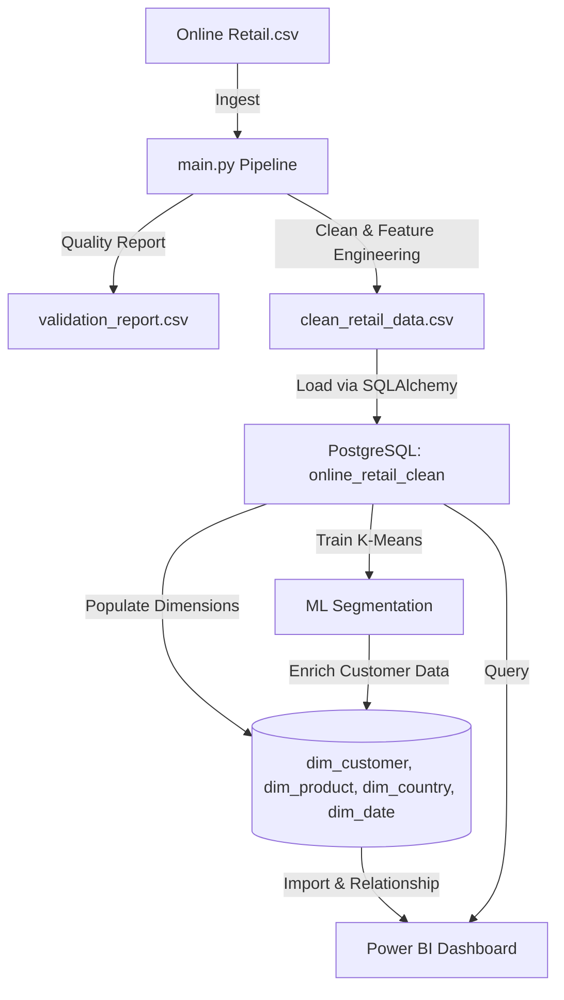

# End-to-End E-Commerce ETL, ML Customer Segmentation & BI Pipeline

An end-to-end data engineering and machine learning project that processes e-commerce retail transactions, cleans and validates the dataset, loads it into a PostgreSQL database, segments customers using K-Means clustering, and visualizes business metrics in Power BI.

---

## 🏗️ Architecture Overview



---

## ✨ Key Features

1. **Robust Ingestion & Validation**: Reads over 540k transaction rows and generates a data-quality audit report tracking duplicates, missing customer IDs, negative values, and cancellations.
2. **Data Cleaning & Feature Engineering**: Filters out returns and null identifiers, creates custom financial features (`Revenue`), and parses temporal fields (`Year`, `Month`, `Quarter`, `Day`, `Weekday`).
3. **Star Schema Dimension Modeling**: Loads data into a PostgreSQL staging table and splits it into structured dimension tables (`dim_customer`, `dim_product`, `dim_country`, `dim_date`).
4. **ML Customer Segmentation**: Extracts RFM (Recency, Frequency, Monetary) metrics, handles features skewness using log-scaling, standardizes values, and trains a K-Means model to segment customers into value-based profiles.
5. **Containerization**: Fully dockerized environment, allowing the entire pipeline to execute in an isolated container while safely connecting to the host database.
6. **Power BI Dashboarding**: Pre-designed dashboard mapping KPIs, monthly revenue trends, product performance, and geospatial sales, with support for customer segment slicing.

---

## 🧠 ML Customer Segmentation Insights

The pipeline executes a K-Means clustering model ($K=4$) on customer RFM behavior to dynamically label customer value profiles:

| Segment | Description | Profile |
| :--- | :--- | :--- |
| **VIP / Champions** | Highest value customers | Lowest Recency (active purchase), highest order count and total spend. |
| **Loyal / Active** | Frequent purchasers | Low Recency, moderate-to-high order count and spend. |
| **At-Risk** | Formerly active customers | Moderate-to-high Recency, below-average frequency and spend. |
| **Hibernating / Lost** | Dormant customers | High Recency, low frequency, and low spend. |

---

## 🚀 Setup & Execution Instructions

### Prerequisites
* Python 3.12
* PostgreSQL Database
* Docker Desktop (Optional, for containerized run)

### Local Development Setup
1. Clone the repository and navigate to the project directory:
   ```bash
   git clone <your-repository-url>
   cd DATA_WAREHOUSING
   ```
2. Create and activate a virtual environment:
   ```bash
   python -m venv .venv
   .venv\Scripts\activate
   ```
3. Install dependencies:
   ```bash
   pip install -r requirements.txt
   ```
4. Create a `.env` file in the root directory:
   ```env
   DB_TYPE=postgresql
   DB_USER=postgres
   DB_PASSWORD=your_database_password
   DB_HOST=localhost
   DB_PORT=5432
   DB_NAME=retail_dw
   ```
5. Place the raw `Online Retail.csv` in `data/raw/` and execute the pipeline:
   ```bash
   python main.py
   ```

---

### Docker Deployment
You can build and run the pipeline inside a Docker container while connecting to your host PostgreSQL database:

1. Build the Docker image:
   ```bash
   docker build -t retail-etl .
   ```
2. Run the pipeline container:
   ```bash
   docker run --env-file .env -e DB_HOST=host.docker.internal --add-host=host.docker.internal:host-gateway retail-etl
   ```
