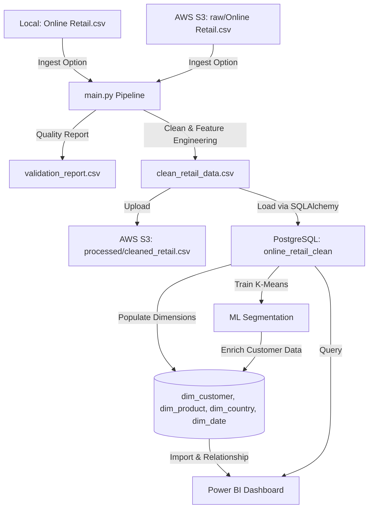

# End-to-End E-Commerce ETL, ML Customer Segmentation & BI Pipeline

An end-to-end data engineering and machine learning project that processes e-commerce retail transactions, cleans and validates the dataset, loads it into a PostgreSQL database, segments customers using K-Means clustering, and visualizes business metrics in Power BI.

This project supports both **local file execution** and **AWS S3 Cloud Integration** for data ingestion and storage.

---

## 🏗️ Architecture Overview



---

## ✨ Key Features

1. **Hybrid Ingestion (Local / AWS S3)**: Capable of reading transaction records locally or fetching them dynamically from an Amazon S3 bucket (`USE_S3=True`).
2. **Cloud Storage Integration**: Automatically uploads the processed and engineered dataset to a designated Amazon S3 bucket for secondary storage or consumption by other downstream processes.
3. **Data Validation & Quality Checks**: Analyzes raw records and creates a quality report highlighting duplicate rows, missing identifiers, returns, and formatting errors.
4. **Data Cleansing & Feature Engineering**: Drops invalid rows, calculates `Revenue`, and extracts chronological dimensions (`Year`, `Month`, `Quarter`, `Day`, `Weekday`).
5. **Dimensional Modeling (Star Schema)**: Segregates staged transaction details into structured dimensions: `dim_customer`, `dim_product`, `dim_country`, and `dim_date`.
6. **ML Customer Segmentation**: Uses **K-Means Clustering** on normalized RFM (Recency, Frequency, Monetary) metrics to label customers into value tiers (*VIP / Champions*, *Loyal / Active*, *At-Risk*, *Hibernating / Lost*).
7. **Containerization (Docker Compose)**: Run the pipeline inside a single Docker container using a one-line command.
8. **Power BI Dashboards**: Interactive visualizations linked to your database schema for real-time segment and revenue analytics.

---

## 🧠 ML Customer Segmentation Insights

The pipeline executes a K-Means clustering model ($K=4$) on customer RFM behavior to dynamically label customer value profiles:

| Segment | Description | Profile |
| :--- | :--- | :--- |
| **VIP / Champions** | Highest value customers | Lowest Recency (active purchase), highest order count and total spend. |
| **Loyal / Active** | Frequent purchasers | Low Recency, moderate-to-high order count and spend. |
| **At-Risk** | Formerly active customers | Moderate-to-high Recency, below-average frequency and spend. |
| **Hibernating / Lost** | Dormant customers | High Recency, low frequency, and low spend. |

---

## 🚀 Setup & Execution Instructions

### Prerequisites
* Python 3.12
* PostgreSQL Database
* AWS S3 Bucket & IAM Credentials (Optional)
* Docker Desktop (Optional)

### Local Development Setup
1. Clone the repository and navigate to the project directory:
   ```bash
   git clone <your-repository-url>
   cd DATA_WAREHOUSING
   ```
2. Create and activate a virtual environment:
   ```bash
   python -m venv .venv
   .venv\Scripts\activate
   ```
3. Install dependencies:
   ```bash
   pip install -r requirements.txt
   ```
4. Create a `.env` file in the root directory:
   ```env
   # Database Credentials
   DB_TYPE=postgresql
   DB_USER=postgres
   DB_PASSWORD=your_database_password
   DB_HOST=localhost
   DB_PORT=5432
   DB_NAME=retail_dw

   # AWS S3 Settings (Optional - set USE_S3=True to enable S3)
   USE_S3=False
   AWS_ACCESS_KEY_ID=your_aws_access_key
   AWS_SECRET_ACCESS_KEY=your_aws_secret_key
   AWS_REGION=your_aws_region
   S3_BUCKET=your_s3_bucket_name
   S3_KEY=raw/Online Retail.csv
   ```
5. Place the raw `Online Retail.csv` in `data/raw/` (if running locally) and execute:
   ```bash
   python main.py
   ```

---

### Docker Deployment
Build and run the pipeline inside a Docker container while connecting to your host PostgreSQL database:

* **Using Docker Compose (Recommended)**:
  ```bash
  docker compose up --build
  ```

* **Using Raw Docker Commands**:
  1. Build the Docker image:
     ```bash
     docker build -t retail-etl .
     ```
  2. Run the pipeline container:
     ```bash
     docker run --env-file .env -e DB_HOST=host.docker.internal --add-host=host.docker.internal:host-gateway retail-etl
     ```
